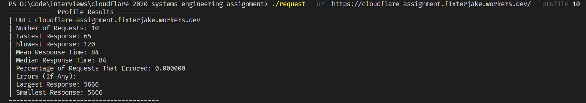
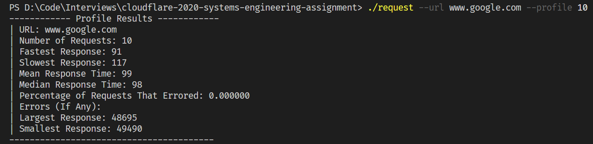
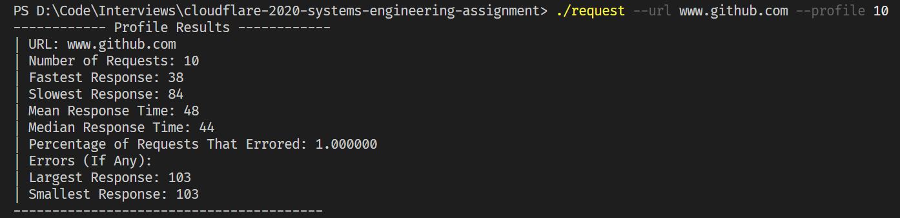
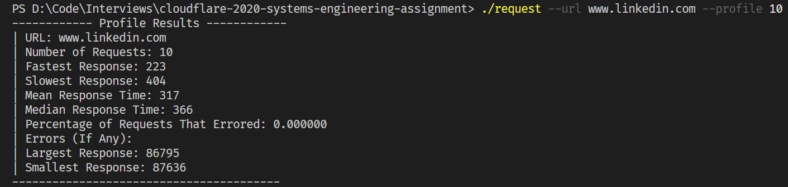

# Systems Assignment

## Language

Choosing a language for this project was fairly difficult. I ended up attempting to mock it up in Rust, C++, and finally Go. This was my first time ever using Go
and some of its features helped a lot for this project. I used things such as channels, and returning multiple values multiple times in this project.

## Requirements

Only requirement is that you have Go installed to access the built in build tooling.

## How to buld and run

* Build
* go build request.go utils.go
* Run
* ./request --url [url] --profile [number of iterations]

## Results

I will preface the screenshots by stating a few things about what I found.

* Linkedin was the slowest, but it was followed closely by Amazon.
* Github was by far the fastest with a mean response time in the 40's to 50's.
* The worker created in the previous assignment was on the quicker size with response times less than 100.

## Screenshots

Worker:

Google:

Github:

Linkedin:

Amazon:

